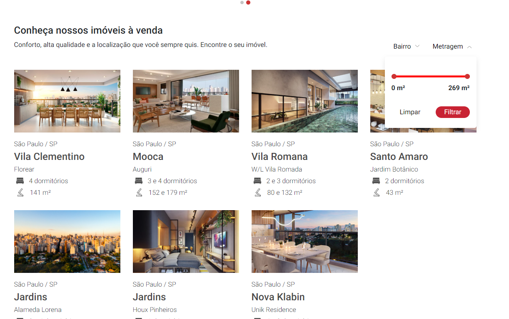

<div align="center">
  <a href="https://github.com/othneildrew/Best-README-Template">
    
  </a>

  <h3 align="center">Studio Wox</h3>

  <p align="center">
    <a href="https://studio-wox.vercel.app/">https://studio-wox.vercel.app/</a>
  </p>
</div>

---

# Introdução


## Descrição

Projeto feito para avaliação feito em NextJS, com responsividade e carregamento inicial usando o getServerSideProps, e usando os sistema de grid do Bootstrap.

### Feito com:

-   
-   
-   
-   

## Como Começar

### Pré requisitos

Para utilizar o projeto é necessário a versão do nodejs v18^, caso esteja usando NVM segue os comandos para instalação da versão usada no projeto:

-   Com NVM:

```sh
nvm install v18.18.0
```

```sh
nvm use v18.18.0
```

### Instalação

Depois de feito o processo de instalação do node de um git clone no projeto

    git clone https://github.com/GabrielKenjiTomariKohatu/studio-wox.git

## Como Usar localmente

Crie o arquivo '.env' na pasta raiz do projeto.

    .env

Depois abra o arquivo e copie o 'API_URL' e coloque o caminho da api na enviroment.

    API_URL={URL}

Na pasta raiz do projeto instale as dependências utilizando o comando abaixo:

    npm i

Instalado as dependências rode o comando abaixo no terminal:

    npm run dev

No final da compilação do projeto vai haver em que porta e url o projeto está sendo rodado que vai ser:

    http://localhost:3000

## Imagens do Projeto


<br>


<br>


<br>



<br>


## Figma protótipo teste:


